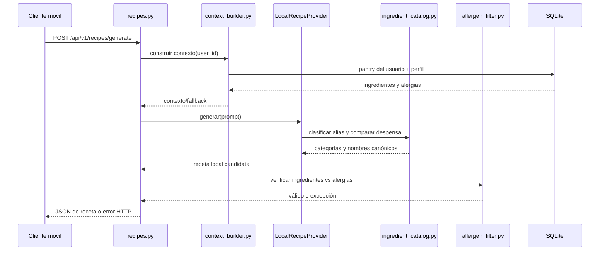

# Guía de entrega: Sprint 02

Este documento describe los módulos del Sprint 02 para facilitar su transferencia y mantenimiento. La generación funciona actualmente sin depender de APIs externas: el proveedor `local` recupera una receta de un catálogo pequeño escrito para el proyecto y clasifica nombres conocidos mediante una taxonomía local.

## Estado del alcance

| Componente | Estado | Observaciones |
| --- | --- | --- |
| Perfil y persistencia de alergias | Implementado | `GET` y `PUT /api/v1/users/profile`; valida el catálogo admitido. |
| Contexto de usuario | Implementado | Recupera despensa y alergias; incluye el fallback solicitado para despensa vacía. |
| Clasificación de ingredientes | Implementado, inicial | Taxonomía local bilingüe con alias; nombres que no reconoce se dejan sin clasificar. |
| Recuperación/generación de receta local | Implementado, inicial | Ordena un catálogo propio de 7 recetas según coincidencias con despensa y restricciones. No llama a un LLM. |
| Filtro determinista | Implementado | Comprueba ingredientes declarados y alias conocidos; no cubre contaminación cruzada ni todos los nombres comerciales. |
| Providers externos | Opcionales | TheMealDB, Spoonacular y un endpoint compatible con chat completions se pueden seleccionar por entorno. |
| Frontend “Mis restricciones” y “Receta sugerida” | Pendiente | En este workspace `frontend/` solo contiene `.env`; no hay pantallas ni integración API. |

El backend está cubierto por tests. Eso no equivale a certificar “0% de falsos negativos” para alergias: la cobertura del filtro depende de que los ingredientes y alias estén disponibles y correctamente expresados.

## Mapa de módulos

### Perfil y alergias

- `app/routers/users.py`: expone `GET /api/v1/users/profile` y `PUT /api/v1/users/profile`. Ambos endpoints usan `get_current_user`, por lo que solo operan sobre el usuario autenticado. El PUT modifica únicamente `alergias` y mantiene el resto del perfil.
- `app/schemas/profile.py`: define `ProfileUpdate` y `ProfileRead`, además del catálogo aceptado: Gluten, Lácteos, Huevos, Maní, Frutos secos, Soya, Pescado y Mariscos. Pydantic devuelve 422 si recibe un valor fuera del catálogo.
- `app/models/user.py`: persiste alergias como JSON y conserva `objetivos_nutricionales`; el Sprint 2 reutiliza el modelo existente.

### Contexto, taxonomía y recuperación local

- `app/services/context_builder.py`: consulta `PantryItem` por `usuario_id` y carga las alergias del usuario. Cuando encuentra despensa, construye el contexto con ingredientes y restricciones. Cuando no hay ingredientes, devuelve el fallback definido por el requisito. El router agrega las alergias a la instrucción del provider sin cambiar ese fallback exacto.
- `app/services/ingredient_catalog.py`: contiene `IngredientInfo` y el catálogo `INGREDIENTS`. Cada entrada relaciona un nombre canónico con categoría, alias en español/inglés y, cuando aplica, etiquetas de alérgenos. `classify_ingredient()` normaliza acentos/puntuación, exige coincidencia por palabra completa y elige el alias más específico. Si no reconoce el nombre, devuelve `None`; no inventa una categoría.
- `app/services/local_recipe_provider.py`: almacena `LOCAL_RECIPES` y realiza la recuperación local. Descarta recetas excluidas, las que coinciden con una alergia directa o clasificada, y las que no usan ningún ingrediente de la despensa cuando esta existe. Las restantes se ordenan por número de ingredientes de despensa coincidentes. Si no encuentra una, lanza `NoLocalRecipeError`, que el router convierte en 422.
- Este flujo se considera **RAG estructurado ligero**: recupera información de un catálogo local y la usa para seleccionar el resultado. No usa embeddings, una base vectorial ni un modelo generativo. La disponibilidad offline y el costo cero se consiguen a cambio de cobertura limitada al contenido del catálogo.

### Generación y seguridad

- `app/schemas/recipes.py`: define el body opcional `excluir_receta` y el contrato JSON de la receta (`nombre`, duración, porciones, calorías, ingredientes, pasos y `apto_para_alergias`).
- `app/services/ai_client.py`: mantiene la interfaz `AIProvider`, el provider `mock`, `APIProvider` y los adaptadores Spoonacular/TheMealDB. `get_ai_provider()` selecciona el provider con `AI_PROVIDER`; si no se configura, usa `local`. Los providers externos son opcionales y necesitan sus propias credenciales/cuotas.
- `app/services/allergen_filter.py`: normaliza ingredientes y restricciones (minúsculas, sin tildes ni signos), expande las etiquetas conocidas con alias español/inglés y compara substrings. Si encuentra una coincidencia, lanza `AllergenDetectedException` con el ingrediente y alérgeno detectados. Los alias viven en `ALLERGEN_ALIASES` y deben ampliarse con nuevos términos comprobados.
- `app/routers/recipes.py`: expone `POST /api/v1/recipes/generate`. Construye el contexto, agrega exclusión si corresponde, invoca el provider con un timeout de 15 segundos y vuelve a comprobar todos los ingredientes antes de responder. Reintenta hasta 3 veces ante una coincidencia del filtro; timeout se traduce a 504, falta de receta local a 422 y errores de provider externo a 502.
- `app/main.py`: registra los routers de autenticación, despensa, usuarios y recetas.

### Configuración y documentación de providers

- `.env.example`: ejemplo de configuración. Para operación sin costo de API: `AI_PROVIDER=local`; no requiere credenciales de proveedor. No se debe guardar una API key real en este archivo.
- `RECIPE_PROVIDERS.md`: describe las diferencias y limitaciones de los proveedores opcionales. TheMealDB usa `THEMEALDB_API_KEY`; la key `1` es de desarrollo/educación. Spoonacular usa `SPOONACULAR_API_KEY` y tiene cuotas sujetas al plan/cuenta.
- Los providers local y TheMealDB reportan `calorias: 0` porque el contrato exige un entero y no tienen datos nutricionales verificados en esta integración. La interfaz no debería presentar ese cero como una medición confirmada.

## Flujo de una generación

## Endpoints de perfil y receta

- `GET /api/v1/users/profile`: requiere Bearer token; devuelve perfil, alergias y objetivos nutricionales.
- `PUT /api/v1/users/profile`: requiere un JSON con `alergias`; no requiere otros campos del perfil.
- `POST /api/v1/recipes/generate`: requiere Bearer token; body opcional `{"excluir_receta": "Nombre anterior"}`. Respuesta 200 usa el schema `RecipeRead`.
- Errores de generación: 422 si el provider local no encuentra una receta compatible o si se agotan reintentos inseguros; 502 si falla el provider externo; 504 si la generación excede 15 segundos.

## Pruebas

- `tests/test_profile.py`: lectura, actualización parcial y rechazo de alergias no permitidas.
- `tests/test_ingredient_catalog.py`: alias español/inglés, categoría y nombres desconocidos.
- `tests/test_allergen_filter.py`: coincidencias exactas, parciales, normalización y alias multilingües.
- `tests/test_recipes.py`: proveedor local default, coincidencias de despensa, alternativas, rechazos, timeout y reintentos.
- `tests/test_recipe_providers.py`: selección de providers y mapeo de respuestas HTTP simuladas; no consume claves ni cuota real.
- Suite validada durante esta entrega: `pytest -q` (53 tests aprobados).

## Cómo ampliar el catálogo

1. Añadir alias revisados a `INGREDIENTS`; conservar nombres canónicos estables y etiquetas de alérgenos justificadas.
2. Añadir recetas propias completas a `LOCAL_RECIPES`, con ingredientes explícitos e instrucciones revisadas. Mantener `calorias: 0` hasta disponer de una fuente nutricional verificada.
3. Agregar tests para cada nuevo alias, categoría, alérgeno y caso de recuperación.
4. Ejecutar `pytest -v` y `ruff check` sobre los archivos modificados.
5. No declarar una receta “segura” frente a trazas, marcas o contaminación cruzada basándose solo en esta lista: el sistema compara los ingredientes publicados por la receta.

## Próximos pendientes del cierre Sprint 2

1. Construir las pantallas frontend de restricciones y receta sugerida, conectar los endpoints y mostrar estados 422/504.
2. Ampliar y revisar el catálogo local con una persona responsable de nutrición/datos; decidir cómo mostrar calorías desconocidas.
3. Definir cómo manejar ingredientes desconocidos: pedir aclaración, impedir generación o permitirlos con revisión explícita. Actualmente no se usan para puntuar coincidencias.
4. Revisar alias por idioma, sinónimos regionales, ingredientes compuestos y trazas. El filtro es una barrera determinista, no una certificación médica.
5. Verificar licencias, atribución y condiciones vigentes antes de distribuir contenido obtenido de providers externos.
